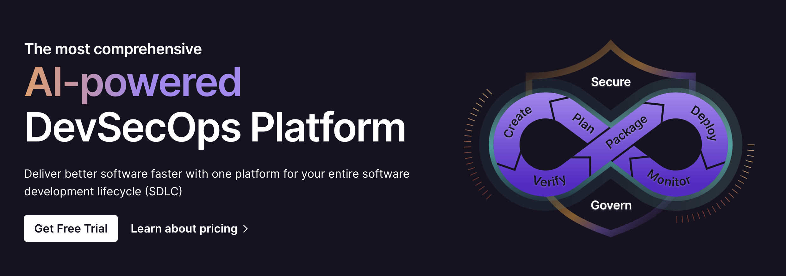

<div align="left">

[](https://gitlab.com)

# [Gitlab](https://gitlab.com)

An OpenAPI definition for the GitLab REST API.
Few API resources or endpoints are currently included.
The intent is to expand this to match the entire Markdown documentation of the API:
<https://docs.gitlab.com/ee/api/>. Contributions are welcome.

When viewing this on gitlab.com, you can test API calls directly from the browser
against the `gitlab.com` instance, if you are logged in.
The feature uses the current [GitLab session cookie](https://docs.gitlab.com/ee/api/index.html#session-cookie),
so each request is made using your account.

Instructions for using this tool can be found in [Interactive API Documentation](https://docs.gitlab.com/ee/api/openapi/openapi_interactive.html)


</div>

## Requirements

Building the API client library requires:

1. Java 1.8+
2. Maven (3.8.3+)/Gradle (7.2+)

If you are adding this library to an Android Application or Library:

3. Android 8.0+ (API Level 26+)

## Installation<a id="installation"></a>
<div align="center">
  <a href="https://konfigthis.com/sdk-sign-up?company=GitLab&language=Java">
    
  </a>
</div>

### Maven users

Add this dependency to your project's POM:

```xml
<dependency>
  <groupId>com.konfigthis</groupId>
  <artifactId>git-lab-java-sdk</artifactId>
  <version>v4</version>
  <scope>compile</scope>
</dependency>
```

### Gradle users

Add this dependency to your `build.gradle`:

```groovy
// build.gradle
repositories {
  mavenCentral()
}

dependencies {
   implementation "com.konfigthis:git-lab-java-sdk:v4"
}
```

### Android users

Make sure your `build.gradle` file as a `minSdk` version of at least 26:
```groovy
// build.gradle
android {
    defaultConfig {
        minSdk 26
    }
}
```

Also make sure your library or application has internet permissions in your `AndroidManifest.xml`:

```xml
<!--AndroidManifest.xml-->
<?xml version="1.0" encoding="utf-8"?>
<manifest xmlns:android="http://schemas.android.com/apk/res/android"
    xmlns:tools="http://schemas.android.com/tools">
    <uses-permission android:name="android.permission.INTERNET"/>
</manifest>
```

### Others

At first generate the JAR by executing:

```shell
mvn clean package
```

Then manually install the following JARs:

* `target/git-lab-java-sdk-v4.jar`
* `target/lib/*.jar`

## Getting Started

Please follow the [installation](#installation) instruction and execute the following Java code:

```java
import com.konfigthis.client.ApiClient;
import com.konfigthis.client.ApiException;
import com.konfigthis.client.ApiResponse;
import com.konfigthis.client.GitLab;
import com.konfigthis.client.Configuration;
import com.konfigthis.client.auth.*;
import com.konfigthis.client.model.*;
import com.konfigthis.client.api.AccessRequestsApi;
import java.util.List;
import java.util.Map;
import java.util.UUID;

public class Example {
  public static void main(String[] args) {
    Configuration configuration = new Configuration();
    configuration.host = "https://www.gitlab.com/api";
    
    configuration.apiKeyAuth  = "YOUR API KEY";
    GitLab client = new GitLab(configuration);
    String id = "id_example"; // The ID or URL-encoded path of the group owned by the authenticated user
    Integer userId = 56; // The user ID of the access requester
    Integer accessLevel = 30; // A valid access level (defaults: `30`, the Developer role)
    try {
      APIEntitiesAccessRequester result = client
              .accessRequests
              .approveForUser(id, userId)
              .accessLevel(accessLevel)
              .execute();
      System.out.println(result);
      System.out.println(result.getId());
      System.out.println(result.getUsername());
      System.out.println(result.getName());
      System.out.println(result.getState());
      System.out.println(result.getAvatarUrl());
      System.out.println(result.getAvatarPath());
      System.out.println(result.getCustomAttributes());
      System.out.println(result.getWebUrl());
      System.out.println(result.getEmail());
      System.out.println(result.getRequestedAt());
    } catch (ApiException e) {
      System.err.println("Exception when calling AccessRequestsApi#approveForUser");
      System.err.println("Status code: " + e.getStatusCode());
      System.err.println("Reason: " + e.getResponseBody());
      System.err.println("Response headers: " + e.getResponseHeaders());
      e.printStackTrace();
    }

    // Use .executeWithHttpInfo() to retrieve HTTP Status Code, Headers and Request
    try {
      ApiResponse<APIEntitiesAccessRequester> response = client
              .accessRequests
              .approveForUser(id, userId)
              .accessLevel(accessLevel)
              .executeWithHttpInfo();
      System.out.println(response.getResponseBody());
      System.out.println(response.getResponseHeaders());
      System.out.println(response.getStatusCode());
      System.out.println(response.getRoundTripTime());
      System.out.println(response.getRequest());
    } catch (ApiException e) {
      System.err.println("Exception when calling AccessRequestsApi#approveForUser");
      System.err.println("Status code: " + e.getStatusCode());
      System.err.println("Reason: " + e.getResponseBody());
      System.err.println("Response headers: " + e.getResponseHeaders());
      e.printStackTrace();
    }
  }
}

```

## Documentation for API Endpoints

All URIs are relative to *https://www.gitlab.com/api*

Class | Method | HTTP request | Description
------------ | ------------- | ------------- | -------------
*AccessRequestsApi* | [**approveForUser**](docs/AccessRequestsApi.md#approveForUser) | **PUT** /api/v4/groups/{id}/access_requests/{user_id}/approve | Approves an access request for the given user.
*AccessRequestsApi* | [**approveForUser_0**](docs/AccessRequestsApi.md#approveForUser_0) | **PUT** /api/v4/projects/{id}/access_requests/{user_id}/approve | Approves an access request for the given user.
*AccessRequestsApi* | [**denyAccessToUser**](docs/AccessRequestsApi.md#denyAccessToUser) | **DELETE** /api/v4/groups/{id}/access_requests/{user_id} | Denies an access request for the given user.
*AccessRequestsApi* | [**denyAccessToUser_0**](docs/AccessRequestsApi.md#denyAccessToUser_0) | **DELETE** /api/v4/projects/{id}/access_requests/{user_id} | Denies an access request for the given user.
*AccessRequestsApi* | [**getList**](docs/AccessRequestsApi.md#getList) | **GET** /api/v4/groups/{id}/access_requests | Gets a list of access requests for a group.
*AccessRequestsApi* | [**getList_0**](docs/AccessRequestsApi.md#getList_0) | **GET** /api/v4/projects/{id}/access_requests | Gets a list of access requests for a project.
*AccessRequestsApi* | [**requestAccessToGroup**](docs/AccessRequestsApi.md#requestAccessToGroup) | **POST** /api/v4/groups/{id}/access_requests | Requests access for the authenticated user to a group.
*AccessRequestsApi* | [**requestAccessToProject**](docs/AccessRequestsApi.md#requestAccessToProject) | **POST** /api/v4/projects/{id}/access_requests | Requests access for the authenticated user to a project.
*AdminApi* | [**getDictionaryDetails**](docs/AdminApi.md#getDictionaryDetails) | **GET** /api/v4/admin/databases/{database_name}/dictionary/tables/{table_name} | 
*AlertManagementApi* | [**authorizeMetricImageUpload**](docs/AlertManagementApi.md#authorizeMetricImageUpload) | **POST** /api/v4/projects/{id}/alert_management_alerts/{alert_iid}/metric_images/authorize | 
*AlertManagementApi* | [**getMetricImagesForAlert**](docs/AlertManagementApi.md#getMetricImagesForAlert) | **GET** /api/v4/projects/{id}/alert_management_alerts/{alert_iid}/metric_images | 
*AlertManagementApi* | [**removeMetricImage**](docs/AlertManagementApi.md#removeMetricImage) | **DELETE** /api/v4/projects/{id}/alert_management_alerts/{alert_iid}/metric_images/{metric_image_id} | 
*AlertManagementApi* | [**updateMetricImage**](docs/AlertManagementApi.md#updateMetricImage) | **PUT** /api/v4/projects/{id}/alert_management_alerts/{alert_iid}/metric_images/{metric_image_id} | 
*AlertManagementApi* | [**uploadMetricImage**](docs/AlertManagementApi.md#uploadMetricImage) | **POST** /api/v4/projects/{id}/alert_management_alerts/{alert_iid}/metric_images | 
*ApplicationApi* | [**getCurrentAppearance**](docs/ApplicationApi.md#getCurrentAppearance) | **GET** /api/v4/application/appearance | 
*ApplicationApi* | [**modifyAppearance**](docs/ApplicationApi.md#modifyAppearance) | **PUT** /api/v4/application/appearance | 
*ApplicationsApi* | [**createNewApplication**](docs/ApplicationsApi.md#createNewApplication) | **POST** /api/v4/applications | Create a new application
*ApplicationsApi* | [**deleteSpecificApplication**](docs/ApplicationsApi.md#deleteSpecificApplication) | **DELETE** /api/v4/applications/{id} | Delete an application
*ApplicationsApi* | [**listAllRegistered**](docs/ApplicationsApi.md#listAllRegistered) | **GET** /api/v4/applications | Get applications
*AvatarApi* | [**getUrlForUser**](docs/AvatarApi.md#getUrlForUser) | **GET** /api/v4/avatar | 
*BadgesApi* | [**addBadgeToGroup**](docs/BadgesApi.md#addBadgeToGroup) | **POST** /api/v4/groups/{id}/badges | Adds a badge to a group.
*BadgesApi* | [**addProjectBadge**](docs/BadgesApi.md#addProjectBadge) | **POST** /api/v4/projects/{id}/badges | Adds a badge to a project.
*BadgesApi* | [**getGroupBadge**](docs/BadgesApi.md#getGroupBadge) | **GET** /api/v4/groups/{id}/badges/{badge_id} | Gets a badge of a group.
*BadgesApi* | [**getList**](docs/BadgesApi.md#getList) | **GET** /api/v4/groups/{id}/badges | Gets a list of group badges viewable by the authenticated user.
*BadgesApi* | [**getProjectBadge**](docs/BadgesApi.md#getProjectBadge) | **GET** /api/v4/projects/{id}/badges/{badge_id} | Gets a badge of a project.
*BadgesApi* | [**listViewableByAuthenticatedUser**](docs/BadgesApi.md#listViewableByAuthenticatedUser) | **GET** /api/v4/projects/{id}/badges | Gets a list of project badges viewable by the authenticated user.
*BadgesApi* | [**previewBadgeFromGroup**](docs/BadgesApi.md#previewBadgeFromGroup) | **GET** /api/v4/groups/{id}/badges/render | Preview a badge from a group.
*BadgesApi* | [**removeFromGroup**](docs/BadgesApi.md#removeFromGroup) | **DELETE** /api/v4/groups/{id}/badges/{badge_id} | Removes a badge from the group.
*BadgesApi* | [**removeFromProject**](docs/BadgesApi.md#removeFromProject) | **DELETE** /api/v4/projects/{id}/badges/{badge_id} | Removes a badge from the project.
*BadgesApi* | [**renderPreviewFromProject**](docs/BadgesApi.md#renderPreviewFromProject) | **GET** /api/v4/projects/{id}/badges/render | Preview a badge from a project.
*BadgesApi* | [**updateGroupBadge**](docs/BadgesApi.md#updateGroupBadge) | **PUT** /api/v4/groups/{id}/badges/{badge_id} | Updates a badge of a group.
*BadgesApi* | [**updateProjectBadge**](docs/BadgesApi.md#updateProjectBadge) | **PUT** /api/v4/projects/{id}/badges/{badge_id} | Updates a badge of a project.
*BatchedBackgroundMigrationsApi* | [**getMigration**](docs/BatchedBackgroundMigrationsApi.md#getMigration) | **GET** /api/v4/admin/batched_background_migrations/{id} | 
*BatchedBackgroundMigrationsApi* | [**list**](docs/BatchedBackgroundMigrationsApi.md#list) | **GET** /api/v4/admin/batched_background_migrations | 
*BatchedBackgroundMigrationsApi* | [**pauseMigration**](docs/BatchedBackgroundMigrationsApi.md#pauseMigration) | **PUT** /api/v4/admin/batched_background_migrations/{id}/pause | 
*BatchedBackgroundMigrationsApi* | [**resumeMigration**](docs/BatchedBackgroundMigrationsApi.md#resumeMigration) | **PUT** /api/v4/admin/batched_background_migrations/{id}/resume | 
*BranchesApi* | [**checkIfExists**](docs/BranchesApi.md#checkIfExists) | **HEAD** /api/v4/projects/{id}/repository/branches/{branch} | 
*BranchesApi* | [**createBranch**](docs/BranchesApi.md#createBranch) | **POST** /api/v4/projects/{id}/repository/branches | 
*BranchesApi* | [**deleteBranch**](docs/BranchesApi.md#deleteBranch) | **DELETE** /api/v4/projects/{id}/repository/branches/{branch} | 
*BranchesApi* | [**deleteMerged**](docs/BranchesApi.md#deleteMerged) | **DELETE** /api/v4/projects/{id}/repository/merged_branches | 
*BranchesApi* | [**getAll**](docs/BranchesApi.md#getAll) | **GET** /api/v4/projects/{id}/repository/branches | 
*BranchesApi* | [**getSingleBranch**](docs/BranchesApi.md#getSingleBranch) | **GET** /api/v4/projects/{id}/repository/branches/{branch} | 
*BranchesApi* | [**protectBranch**](docs/BranchesApi.md#protectBranch) | **PUT** /api/v4/projects/{id}/repository/branches/{branch}/protect | 
*BranchesApi* | [**unprotectBranch**](docs/BranchesApi.md#unprotectBranch) | **PUT** /api/v4/projects/{id}/repository/branches/{branch}/unprotect | 
*BroadcastMessagesApi* | [**createMessage**](docs/BroadcastMessagesApi.md#createMessage) | **POST** /api/v4/broadcast_messages | Create a broadcast message
*BroadcastMessagesApi* | [**deleteMessage**](docs/BroadcastMessagesApi.md#deleteMessage) | **DELETE** /api/v4/broadcast_messages/{id} | Delete a broadcast message
*BroadcastMessagesApi* | [**getSpecificMessage**](docs/BroadcastMessagesApi.md#getSpecificMessage) | **GET** /api/v4/broadcast_messages/{id} | Get a specific broadcast message
*BroadcastMessagesApi* | [**listAll**](docs/BroadcastMessagesApi.md#listAll) | **GET** /api/v4/broadcast_messages | Get all broadcast messages
*BroadcastMessagesApi* | [**updateMessage**](docs/BroadcastMessagesApi.md#updateMessage) | **PUT** /api/v4/broadcast_messages/{id} | Update a broadcast message
*BulkImportsApi* | [**getEntityDetails**](docs/BulkImportsApi.md#getEntityDetails) | **GET** /api/v4/bulk_imports/{import_id}/entities/{entity_id} | Get GitLab Migration entity details
*BulkImportsApi* | [**getMigrationDetails**](docs/BulkImportsApi.md#getMigrationDetails) | **GET** /api/v4/bulk_imports/{import_id} | Get GitLab Migration details
*BulkImportsApi* | [**listEntities**](docs/BulkImportsApi.md#listEntities) | **GET** /api/v4/bulk_imports/{import_id}/entities | List GitLab Migration entities
*BulkImportsApi* | [**listEntities_0**](docs/BulkImportsApi.md#listEntities_0) | **GET** /api/v4/bulk_imports/entities | List all GitLab Migrations&#39; entities
*BulkImportsApi* | [**listMigrations**](docs/BulkImportsApi.md#listMigrations) | **GET** /api/v4/bulk_imports | List all GitLab Migrations
*BulkImportsApi* | [**startNewMigration**](docs/BulkImportsApi.md#startNewMigration) | **POST** /api/v4/bulk_imports | Start a new GitLab Migration
*CiVariablesApi* | [**createNewInstanceVariable**](docs/CiVariablesApi.md#createNewInstanceVariable) | **POST** /api/v4/admin/ci/variables | 
*CiVariablesApi* | [**deleteInstanceVariable**](docs/CiVariablesApi.md#deleteInstanceVariable) | **DELETE** /api/v4/admin/ci/variables/{key} | 
*CiVariablesApi* | [**getSpecificInstanceVariable**](docs/CiVariablesApi.md#getSpecificInstanceVariable) | **GET** /api/v4/admin/ci/variables/{key} | 
*CiVariablesApi* | [**listInstanceVariables**](docs/CiVariablesApi.md#listInstanceVariables) | **GET** /api/v4/admin/ci/variables | 
*CiVariablesApi* | [**updateInstanceVariable**](docs/CiVariablesApi.md#updateInstanceVariable) | **PUT** /api/v4/admin/ci/variables/{key} | 
*ClustersApi* | [**addExistingKubernetesInstanceCluster**](docs/ClustersApi.md#addExistingKubernetesInstanceCluster) | **POST** /api/v4/admin/clusters/add | Add existing instance cluster
*ClustersApi* | [**deleteInstanceCluster**](docs/ClustersApi.md#deleteInstanceCluster) | **DELETE** /api/v4/admin/clusters/{cluster_id} | Delete instance cluster
*ClustersApi* | [**getSingleInstanceCluster**](docs/ClustersApi.md#getSingleInstanceCluster) | **GET** /api/v4/admin/clusters/{cluster_id} | Get a single instance cluster
*ClustersApi* | [**listInstanceClusters**](docs/ClustersApi.md#listInstanceClusters) | **GET** /api/v4/admin/clusters | List instance clusters
*ClustersApi* | [**updateInstanceCluster**](docs/ClustersApi.md#updateInstanceCluster) | **PUT** /api/v4/admin/clusters/{cluster_id} | Edit instance cluster
*JobsApi* | [**getSingleById**](docs/JobsApi.md#getSingleById) | **GET** /api/v4/projects/{id}/jobs/{job_id} | Get a single job by ID
*JobsApi* | [**listForProject**](docs/JobsApi.md#listForProject) | **GET** /api/v4/projects/{id}/jobs | List jobs for a project
*JobsApi* | [**runManualJob**](docs/JobsApi.md#runManualJob) | **POST** /api/v4/projects/{id}/jobs/{job_id}/play | Run a manual job
*MetadataApi* | [**getInformation**](docs/MetadataApi.md#getInformation) | **GET** /api/v4/metadata | Retrieve metadata information for this GitLab instance
*MetadataApi* | [**getVersionInformation**](docs/MetadataApi.md#getVersionInformation) | **GET** /api/v4/version | Retrieves version information for the GitLab instance
*MigrationsApi* | [**markAsExecuted**](docs/MigrationsApi.md#markAsExecuted) | **POST** /api/v4/admin/migrations/{timestamp}/mark | 
*PlanLimitsApi* | [**getCurrentLimits**](docs/PlanLimitsApi.md#getCurrentLimits) | **GET** /api/v4/application/plan_limits | Get current plan limits
*PlanLimitsApi* | [**modifyLimits**](docs/PlanLimitsApi.md#modifyLimits) | **PUT** /api/v4/application/plan_limits | Change plan limits


## Documentation for Models

 - [APIEntitiesAccessRequester](docs/APIEntitiesAccessRequester.md)
 - [APIEntitiesAppearance](docs/APIEntitiesAppearance.md)
 - [APIEntitiesApplication](docs/APIEntitiesApplication.md)
 - [APIEntitiesApplicationWithSecret](docs/APIEntitiesApplicationWithSecret.md)
 - [APIEntitiesAvatar](docs/APIEntitiesAvatar.md)
 - [APIEntitiesBadge](docs/APIEntitiesBadge.md)
 - [APIEntitiesBasicBadgeDetails](docs/APIEntitiesBasicBadgeDetails.md)
 - [APIEntitiesBatchedBackgroundMigration](docs/APIEntitiesBatchedBackgroundMigration.md)
 - [APIEntitiesBranch](docs/APIEntitiesBranch.md)
 - [APIEntitiesBroadcastMessage](docs/APIEntitiesBroadcastMessage.md)
 - [APIEntitiesBulkImport](docs/APIEntitiesBulkImport.md)
 - [APIEntitiesBulkImports](docs/APIEntitiesBulkImports.md)
 - [APIEntitiesBulkImportsEntityFailure](docs/APIEntitiesBulkImportsEntityFailure.md)
 - [APIEntitiesCiVariable](docs/APIEntitiesCiVariable.md)
 - [APIEntitiesCluster](docs/APIEntitiesCluster.md)
 - [APIEntitiesCommit](docs/APIEntitiesCommit.md)
 - [APIEntitiesCustomAttribute](docs/APIEntitiesCustomAttribute.md)
 - [APIEntitiesDictionaryTable](docs/APIEntitiesDictionaryTable.md)
 - [APIEntitiesJob](docs/APIEntitiesJob.md)
 - [APIEntitiesJobProject](docs/APIEntitiesJobProject.md)
 - [APIEntitiesMetadata](docs/APIEntitiesMetadata.md)
 - [APIEntitiesMetadataKas](docs/APIEntitiesMetadataKas.md)
 - [APIEntitiesMetricImage](docs/APIEntitiesMetricImage.md)
 - [APIEntitiesPlanLimit](docs/APIEntitiesPlanLimit.md)
 - [APIEntitiesPlatformKubernetes](docs/APIEntitiesPlatformKubernetes.md)
 - [APIEntitiesProjectIdentity](docs/APIEntitiesProjectIdentity.md)
 - [APIEntitiesProviderGcp](docs/APIEntitiesProviderGcp.md)
 - [APIEntitiesUserBasic](docs/APIEntitiesUserBasic.md)
 - [AccessrequestsApproveForUserRequest](docs/AccessrequestsApproveForUserRequest.md)
 - [AccessrequestsApproveForUserRequest1](docs/AccessrequestsApproveForUserRequest1.md)
 - [AlertmanagementUpdateMetricImageRequest](docs/AlertmanagementUpdateMetricImageRequest.md)
 - [AlertmanagementUploadMetricImageRequest](docs/AlertmanagementUploadMetricImageRequest.md)
 - [ApplicationModifyAppearanceRequest](docs/ApplicationModifyAppearanceRequest.md)
 - [ApplicationsCreateNewApplicationRequest](docs/ApplicationsCreateNewApplicationRequest.md)
 - [BadgesAddBadgeToGroupRequest](docs/BadgesAddBadgeToGroupRequest.md)
 - [BadgesAddProjectBadgeRequest](docs/BadgesAddProjectBadgeRequest.md)
 - [BadgesUpdateGroupBadgeRequest](docs/BadgesUpdateGroupBadgeRequest.md)
 - [BadgesUpdateProjectBadgeRequest](docs/BadgesUpdateProjectBadgeRequest.md)
 - [BatchedbackgroundmigrationsPauseMigrationRequest](docs/BatchedbackgroundmigrationsPauseMigrationRequest.md)
 - [BatchedbackgroundmigrationsResumeMigrationRequest](docs/BatchedbackgroundmigrationsResumeMigrationRequest.md)
 - [BranchesProtectBranchRequest](docs/BranchesProtectBranchRequest.md)
 - [BroadcastmessagesCreateMessageRequest](docs/BroadcastmessagesCreateMessageRequest.md)
 - [BroadcastmessagesUpdateMessageRequest](docs/BroadcastmessagesUpdateMessageRequest.md)
 - [BulkimportsStartNewMigrationRequest](docs/BulkimportsStartNewMigrationRequest.md)
 - [CivariablesCreateNewInstanceVariableRequest](docs/CivariablesCreateNewInstanceVariableRequest.md)
 - [CivariablesUpdateInstanceVariableRequest](docs/CivariablesUpdateInstanceVariableRequest.md)
 - [ClustersAddExistingKubernetesInstanceClusterRequest](docs/ClustersAddExistingKubernetesInstanceClusterRequest.md)
 - [ClustersUpdateInstanceClusterRequest](docs/ClustersUpdateInstanceClusterRequest.md)
 - [MigrationsMarkAsExecutedRequest](docs/MigrationsMarkAsExecutedRequest.md)
 - [PlanlimitsModifyLimitsRequest](docs/PlanlimitsModifyLimitsRequest.md)


## Author
This Java package is automatically generated by [Konfig](https://konfigthis.com)
